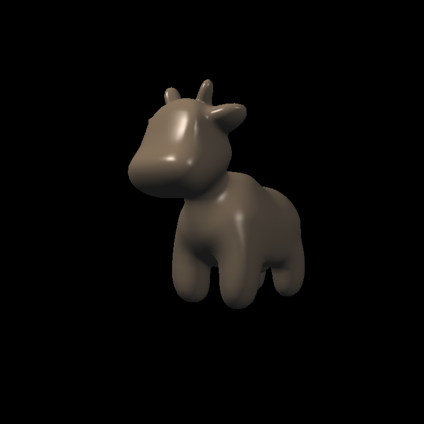
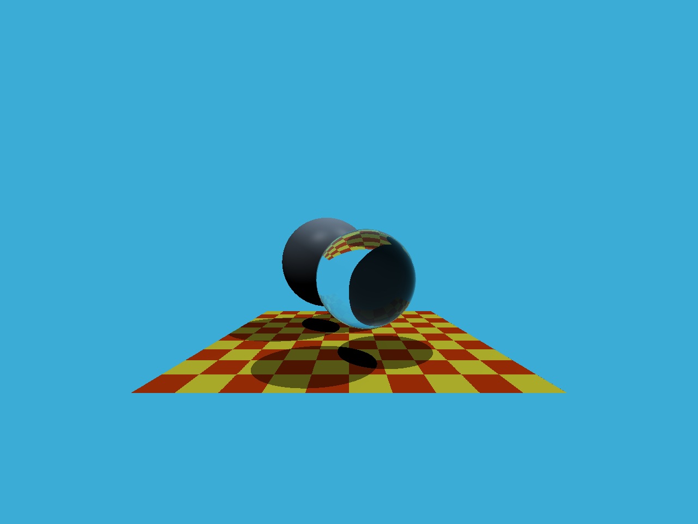
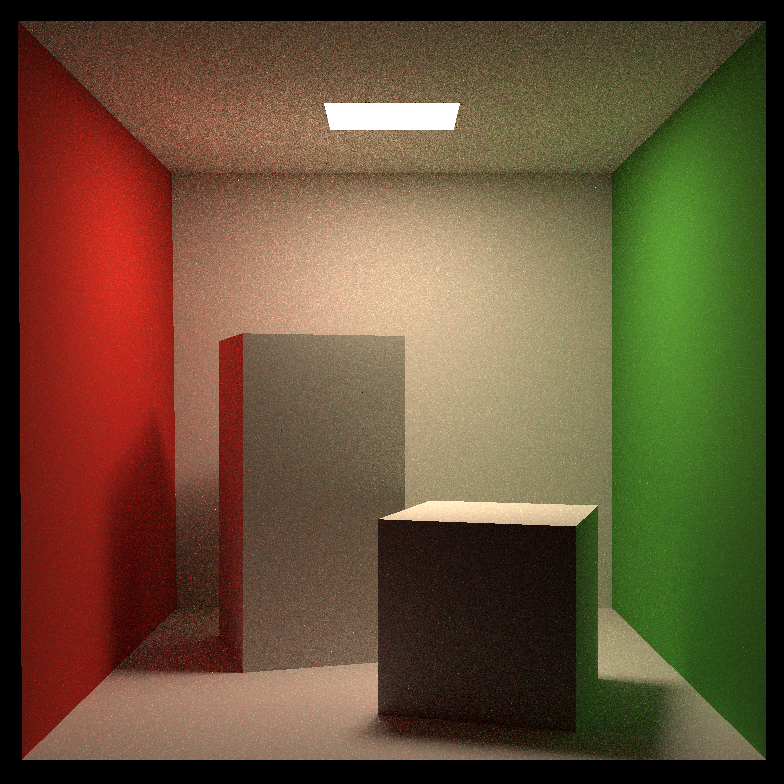

# games101-homework

## Assignment1 旋转与投影

## Assignment2 深度测试

## Assignment3 渲染

## Assignment4 贝塞尔曲线

## Assignment5 简单的光线追踪

## Assignment6 BVH加速

## Assignment7 简单的路径追踪

## Assignment8 质点弹簧系统
